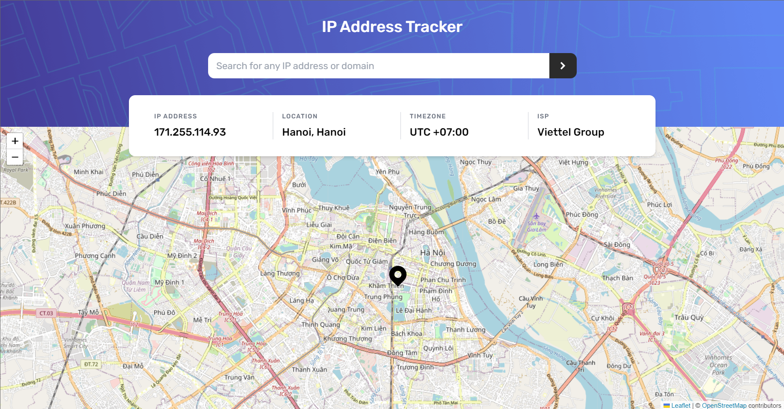

# Frontend Mentor - IP address tracker solution

This is a solution to the [IP address tracker challenge on Frontend Mentor](https://www.frontendmentor.io/challenges/ip-address-tracker-I8-0yYAH0). Frontend Mentor challenges help you improve your coding skills by building realistic projects.

## Table of contents

- [Overview](#overview)
  - [The challenge](#the-challenge)
  - [Screenshot](#screenshot)
  - [Links](#links)
- [My process](#my-process)
  - [Built with](#built-with)
  - [What I learned](#what-i-learned)
  - [Continued development](#continued-development)
  - [Useful resources](#useful-resources)
- [Author](#author)

## Overview

### The challenge

Users should be able to:

- View the optimal layout for each page depending on their device's screen size
- See hover states for all interactive elements on the page
- See their own IP address on the map on the initial page load
- Search for any IP addresses or domains and see the key information and location

### Screenshot

### Links

- Solution URL: [Add solution URL here](https://github.com/mqdo/ip-address-tracker-master)
- Live Site URL: [Add live site URL here](https://mqdo-ip-tracking.netlify.app.com)

## My process

### Built with

- Mobile-first workflow
- [React](https://reactjs.org/) - JS library
- [TailwindCSS](https://tailwindcss.com/) - For styles
- [Geo Ipify](https://geo.ipify.org/) - API for IP Geolocation
- [React Leaflet](https://react-leaflet.js.org/) - API for Maps

### What I learned

In this challenge I learned how to use APIs to get information from IP addresses and learn an easy way to generate a map by using Leaflet's API. I also practice with React.js and Tailwind to add one more project to my portfolio.

### Continued development

After this challenge I will use more tools together to create flexible applications.

### Useful resources

- [React Leaflet Docs](https://react-leaflet.js.org/) - This helped me for knowing how React Leaflet works, as I have never worked with an API map like this before.
- [Stack Overflow](https://stackoverflow.com/) - Of course, whenever I'm stuck with some bugs this is the place that can save me.

## Author

- Github - [mqdo](https://github.com/mqdo)
- Frontend Mentor - [@mqdo](https://www.frontendmentor.io/profile/mqdo)
